# Labenu Music Awards (LAMA)

This is a React project that simulates a website that manages a music festival lasting three days. The bands start playing at 8am and finish at 11pm. There are two different types of user roles: ADMIN and NORMAL. Only ADMIN users can register bands, concerts, tickets and photos and also delete photos.

Data was consumed from an API Rest developed by me. The link of the github repository is: https://github.com/francinehahn/Labenu-Music-Awards-Backend

## Functionalities
* On the login page, users can log into the website and on the signup page, they can create a new account;
* On the home page, users can see all the scheduled concerts;
* On the tickets page, users can see all the tickets available for purchase;
* On the photos page, users can see the pictures of each day of the event and admin users, when logged in, can also click on a button to add more photos and click on the photos to delete them (a confirmation message will appear before the photo is deleted);
* On the cart page, users can see all the tickets that were added to cart, delete them or change the units of each one of them; If the user is logged in, he/she can complete the order;
* On the profile page, which can only be accessed after login, users can see all their purchases; admin users can also register new bands, new concerts and new tickets.

## Technologies
* Typescript
* HTML
* Styled-components
* React.js

## Deploy
https://labenu-music-awards-frontend.vercel.app/

## Images
### Desktop version
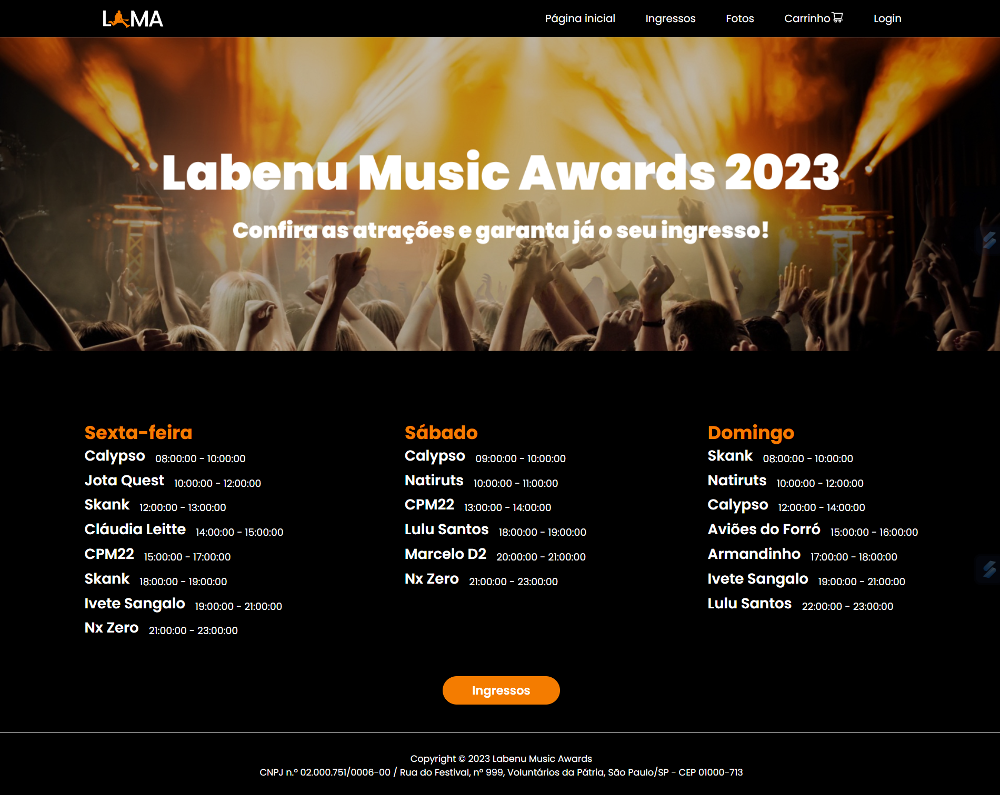
 

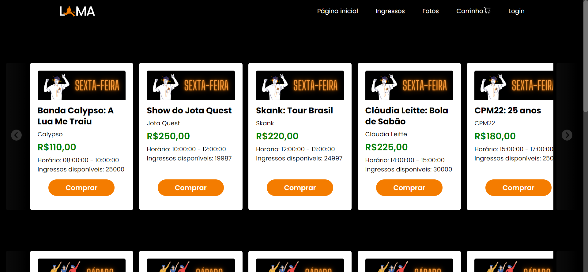
 

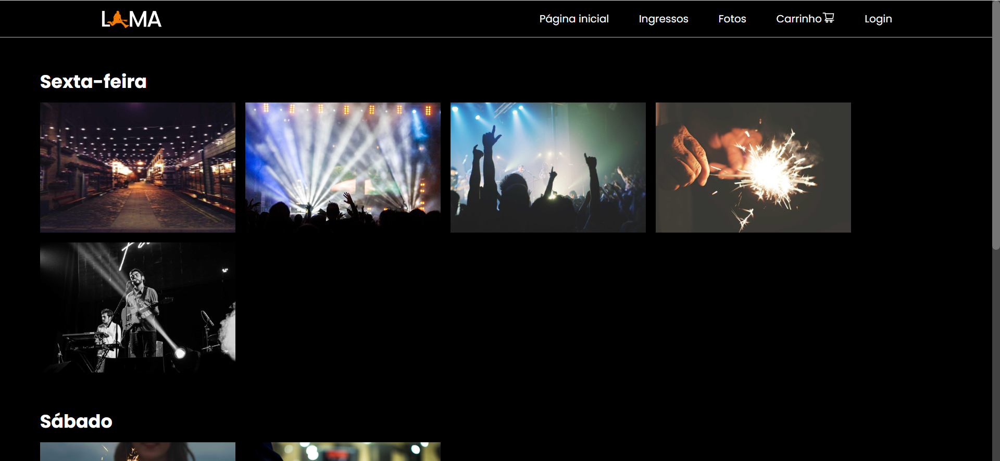
 

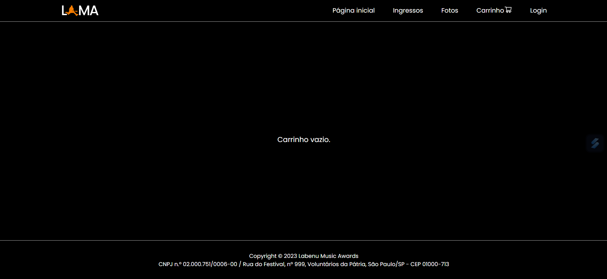
 

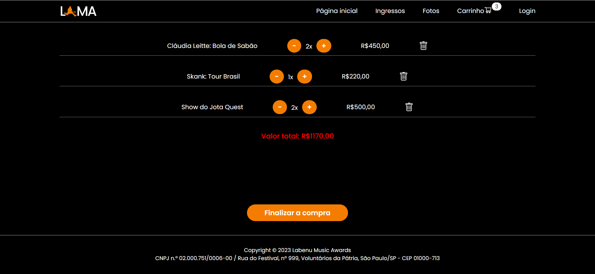
 

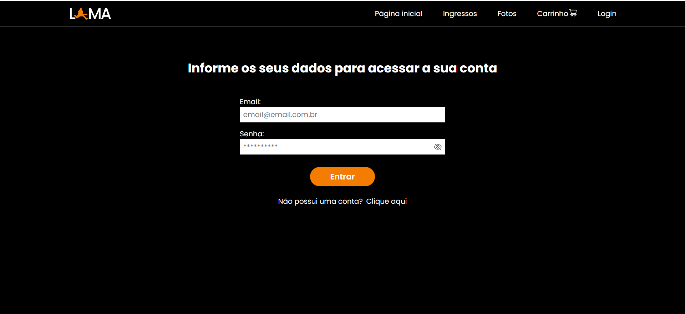
 

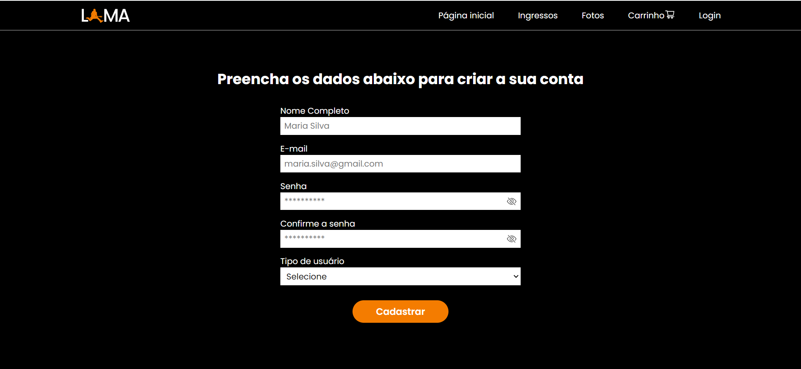
 

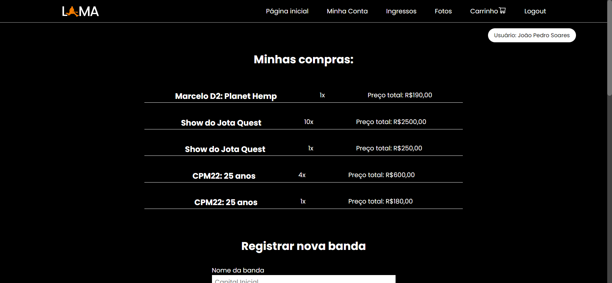
 

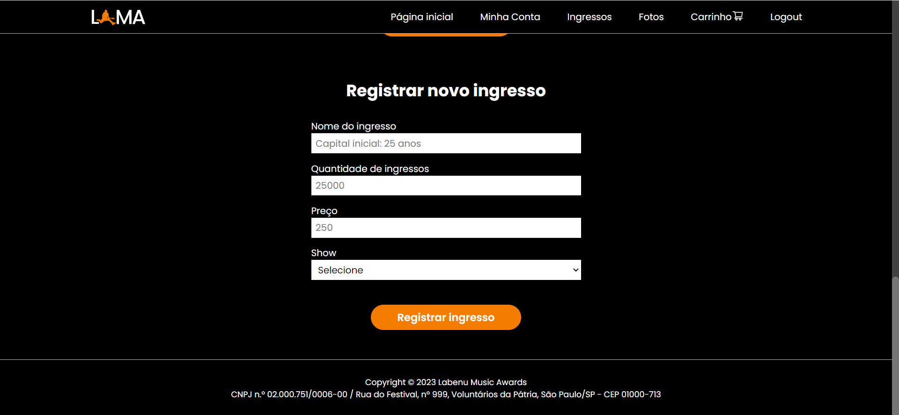
 

### Mobile version
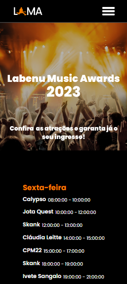
 

 

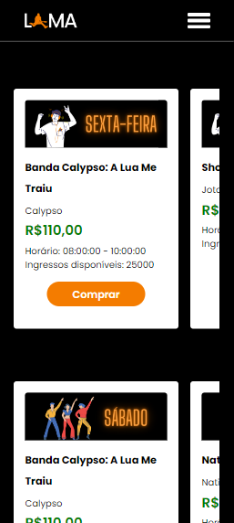
 

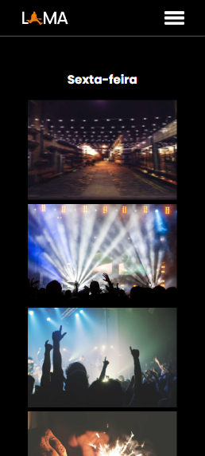
 

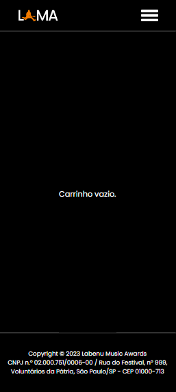
 

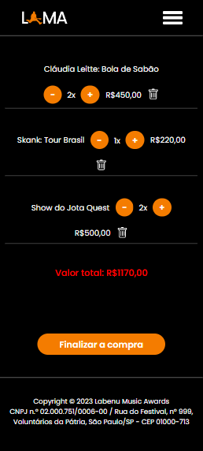
 

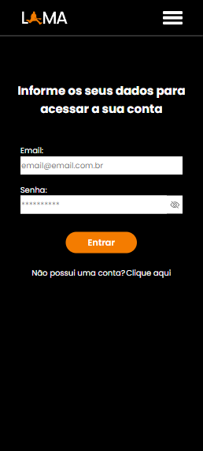
 

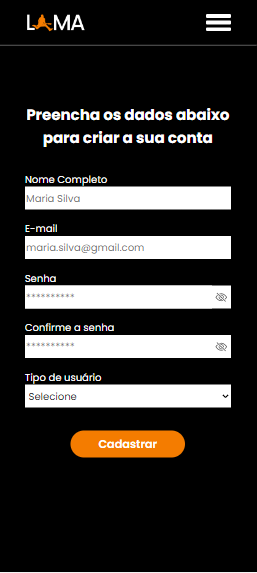
 

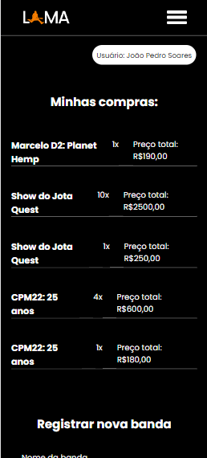
 

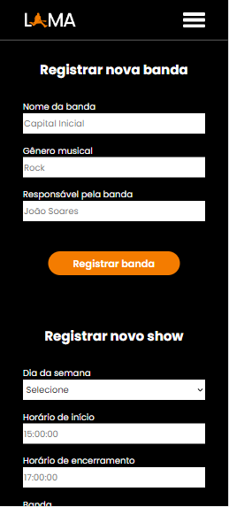
 